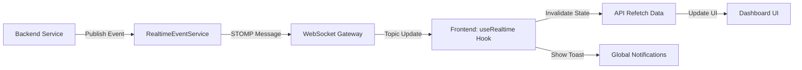

# ⚡ BloodLink Real-Time Architecture Guide

This document explains the implementation of real-time updates and live notifications in the BloodLink platform.

## 🏗 Architecture Overview

The system follows a **Safe Event-Driven Refresh** pattern. Instead of sending complex data objects over WebSockets (which can lead to race conditions or stale state), we send **minimal event signals** that trigger standard REST API refreshes.



---

## 🔌 Backend Implementation (Spring Boot)

### 1. WebSocket Configuration
Located in `com.example.bloodbank.config.WebSocketConfig.java`.
- **Protocol**: STOMP (Simple Text Oriented Messaging Protocol)
- **Transport**: SockJS (for fallback support)
- **Endpoint**: `/ws`

### 2. Event Publishing
The `RealtimeEventService` handles dispatching messages to specific topics:
- `/topic/user/{userId}`: User-specific events (Eligibility, Donation status).
- `/topic/org/{orgId}`: Organization-specific events (New requests, Inventory).
- `/topic/hospital/{hospitalId}`: Hospital-specific events (Request approval, Fulfillment).
- `/topic/inventory`: Global stock updates.

### 3. Triggering Events
Events are triggered in the Service layer after successful database operations:
```java
eventService.sendOrgEvent(orgId, "NEW_BLOOD_REQUEST", savedRequest);
```

---

## 🖥 Frontend Implementation (React)

### 1. The `useRealtime` Hook
Located in `src/hooks/useRealtime.js`.
This hook abstracts the complexity of connection management:
- **Auto-Subscription**: Automatically subscribes to the correct topic based on the logged-in user's role and ID.
- **Connection Lifecycle**: Connects on mount, disconnects on unmount.
- **Vite Polyfill**: Includes a `global` polyfill to support legacy `sockjs-client` in a modern Vite environment.

### 2. Implementation Pattern: "Signal to Refresh"
We strictly follow the rule: **Never mutate state directly from a Socket payload.**
- ✅ **DO**: Use the socket event as a signal to call your existing `fetchData()` function.
- ❌ **DON'T**: Manually append objects to lists from socket data (risks duplicating data if the API fetch also runs).

**Example in `UserHome.jsx`:**
```javascript
useRealtime((event) => {
    fetchData(); // Triggers standard API refresh
});
```

### 3. Global Notifications
The `NotificationContext` (`src/context/NotificationContext.jsx`) listens to the WebSocket stream globally.
- It maps event types (e.g., `DONATION_COMPLETED`) to user-friendly messages.
- Displays animated "Toasts" using Framer Motion.

---

## 🔐 Security & Safety
- **Non-Breaking**: The real-time layer is an enhancement. If the WebSocket fails, the app continues to work via normal page reloads or manual refreshes.
- **Permit All Gateway**: The `/ws` endpoint is permitted in `SecurityConfig`, but data access behind the refresh remains protected by JWT on the REST endpoints.

## 🚀 How to Test
1.  Open two different browsers/tabs.
2.  Login as a **Hospital** in one and an **Organization** in the other.
3.  Create a request from the Hospital.
4.  Observe the **Organization** dashboard update instantly with a notification toast!
